# IDE JetBrains PhpStorm
This document describing how you can configure your IDE [PhpStorm](https://www.jetbrains.com/phpstorm/).

## Configuring PhpStorm
### General
* Go to `Settings -> Plugins` and install next plugins:
    - .env files support
    - .ignore
    - Makefile Language
    - Php Inspections (EA Extended)
    - Laravel Idea (trial)
    - Laravel Query
    - Laravel Tinker
    - Laravel Generator
    - Rainbow brackets
    - String Manipulation
    - Extra ToolWindow Colorful Icons
* Go to `Settings -> Php -> Frameworks -> Laravel Idea` and check settings for `Laravel Idea` plugin.
* If you want control quality of your PHP project - pay your attention to the tools, described [here](development.md).

### CLI Interpreter
You need to set correct CLI interpreter for your PhpStorm.
In order to do it please open `Settings -> PHP` section and follow recommendations [configuring remote PHP interpreters](https://www.jetbrains.com/help/phpstorm/configuring-remote-interpreters.html).

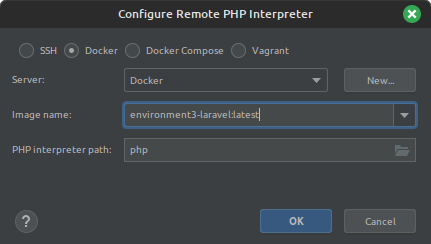
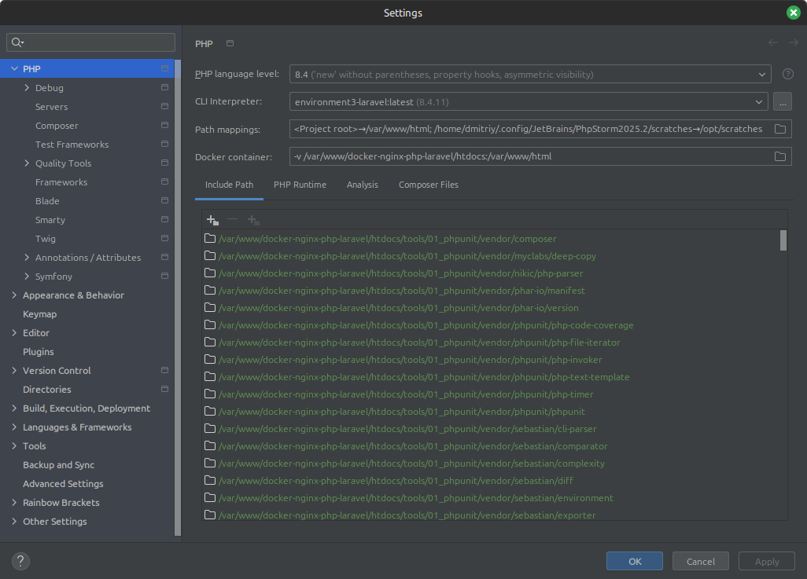

### Composer
Go to `Settings -> Php -> Composer` and set path to composer.json, check other settings:

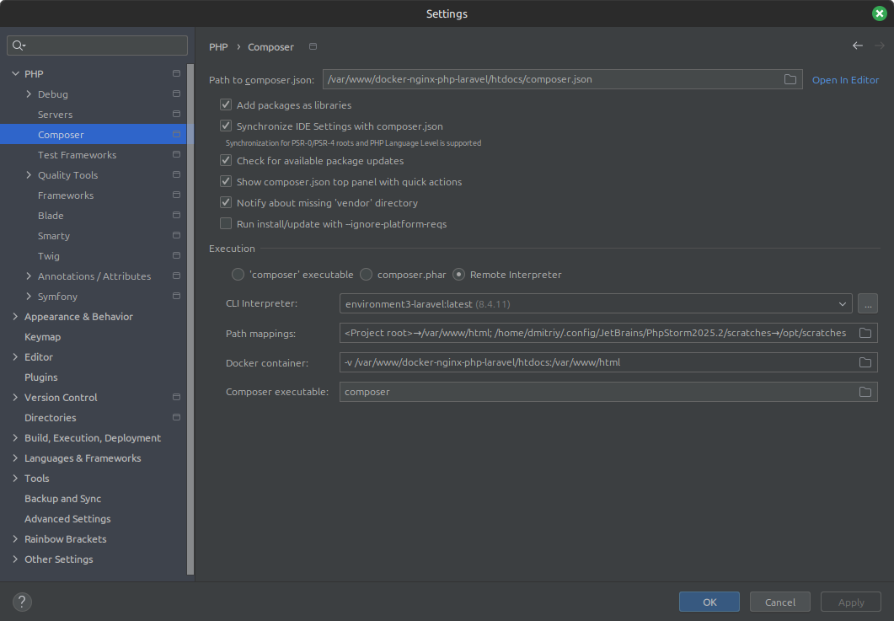

### Server
In order to configure PHP servers please open `Settings -> PHP -> Servers`.
You need to configure how your local files will be mapped inside docker container:

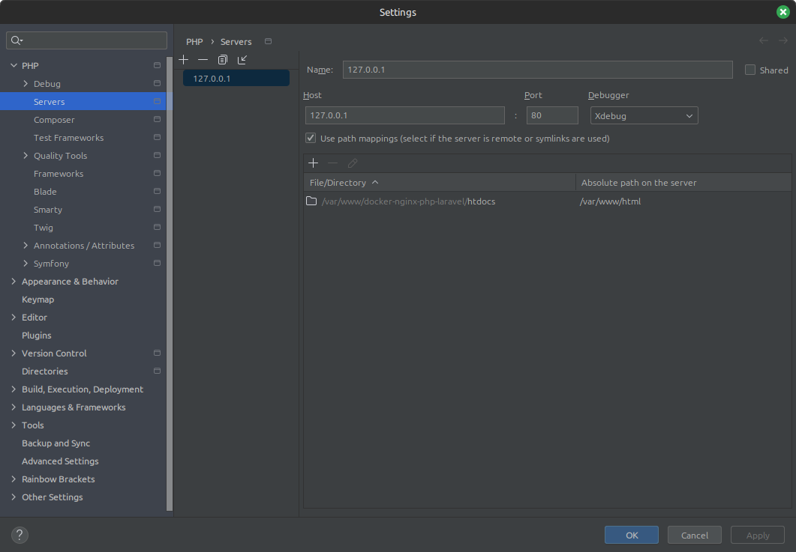

### Test Frameworks
If you want to run tests directly from your IDE you need to do following configuration in `Settings -> PHP -> Test Frameworks`:

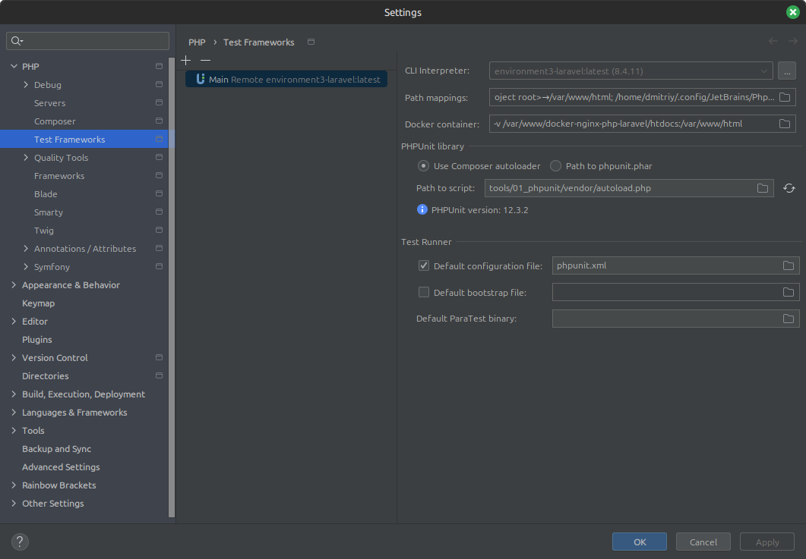

Next you need to add Run/Debug configuration for PHP Remote Debug. It needs to be the same as image below:

### Debugging
In order to use Xdebug as debugging tool please follow [Using Xdebug](xdebug.md) documentation.

### Code Style
This environment has committed `.idea/` catalog, so most IDE configs should be available out of the box. But if you want to have own configs, you can put `./idea` in gitignore and delete folder from the git repository.
Anyway you can always import our recommended code style if you don't have committed `./idea` folder inside your repository: 
* Go to `Settings -> Editor -> Code Style -> PHP` and import scheme `Project` (CodeStyle.xml) from [docs/phpstorm](phpstorm):

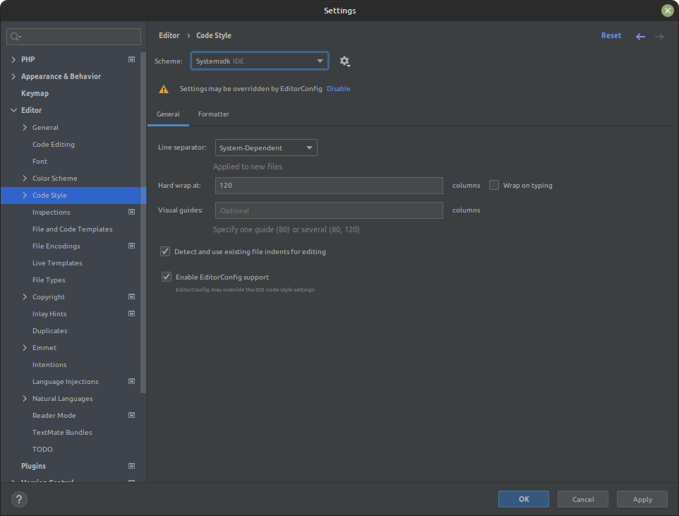

### PHP Inspections and code quality tools
* Go to `Settings -> PHP -> Quality tools` and configure next:

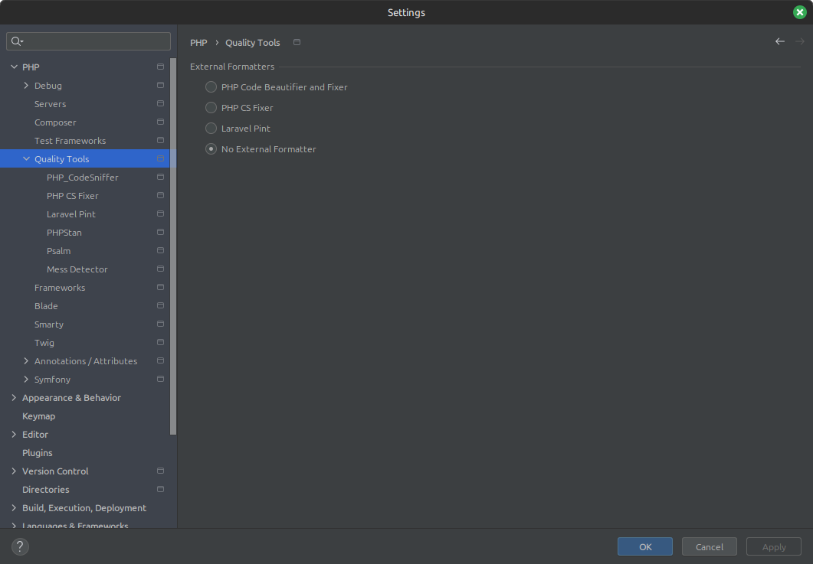
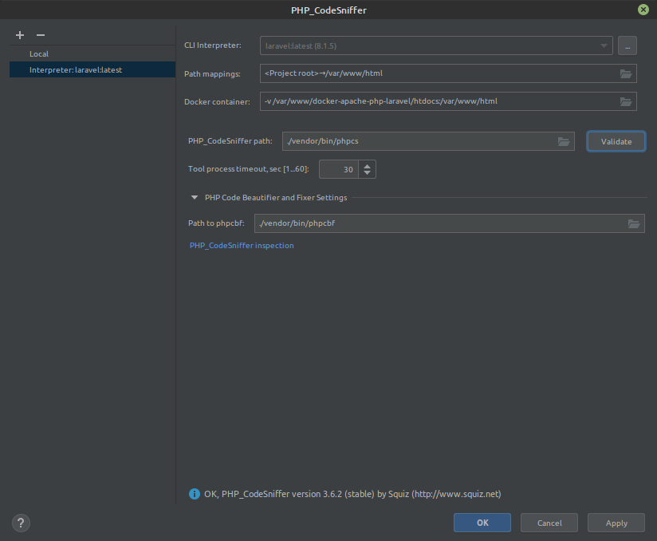
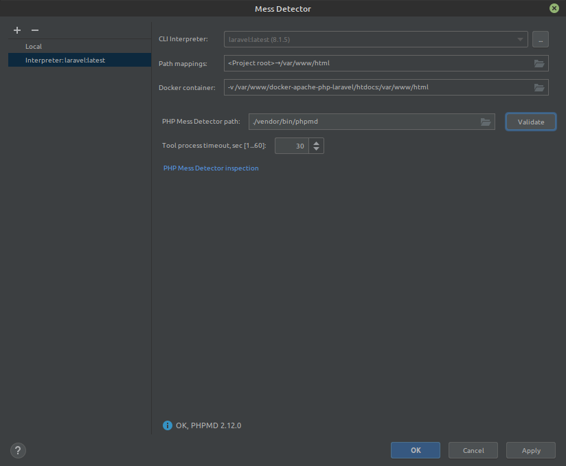
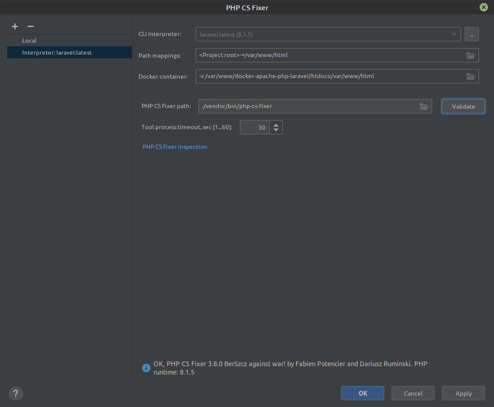
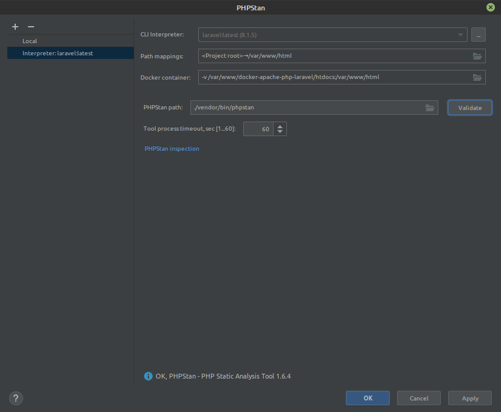

* Set other configurations for code quality tools and make sure that you have proper path for the MessDetector ruleset `phpmd_ruleset.xml`:

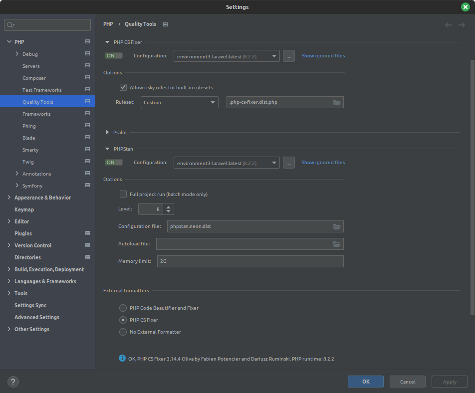

* If you don't have committed folder `.idea/`, go to `Settings -> Editor -> Inspections` and import profile `Project Default` (Inspections.xml) from [docs/phpstorm](phpstorm):

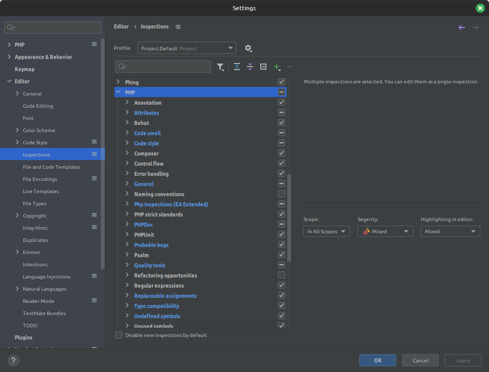

* Go to `Settings -> Tools -> External tools` and create ecs tool:

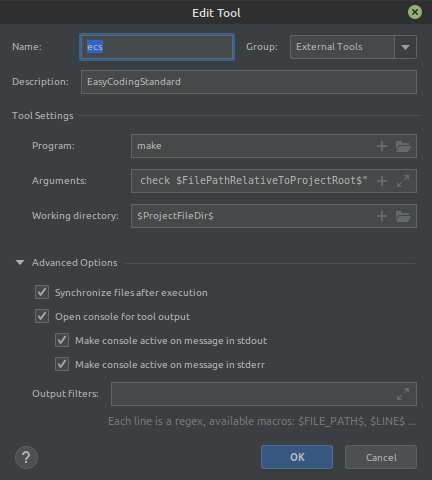

Note: Arguments value should be `exec-bash cmd="./vendor/bin/ecs --clear-cache check $FilePathRelativeToProjectRoot$"`.

Note: In order to use it - right click on the necessary file/folder in PhpStorm and select context menu `External Tools -> ecs`.

* Go to `Settings -> Tools -> External tools` and create phpcs tool:

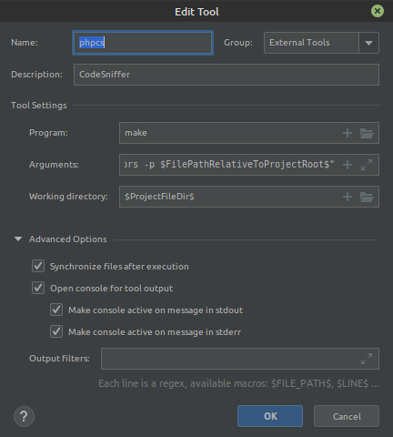

Note: Arguments value should be `exec-bash cmd="./vendor/bin/phpcs --version && ./vendor/bin/phpcs --standard=PSR12 --colors -p $FilePathRelativeToProjectRoot$"`.

Note: In order to use it - right click on the necessary file/folder in PhpStorm and select context menu `External Tools -> phpcs`.

For inspecting your code you can use main menu item `Code -> Inspect Code`. Code will be processed by code quality tools like PHP CS Fixer, PHP Mess Detector, PHP CodeSniffer, PHPStan. 

## External documentations
* [Configuring Remote PHP Interpreters](https://www.jetbrains.com/help/phpstorm/configuring-remote-interpreters.html)
* [Test Frameworks](https://www.jetbrains.com/help/phpstorm/php-test-frameworks.html)
* [Laravel Development using PhpStorm](https://blog.jetbrains.com/phpstorm/2015/01/laravel-development-using-phpstorm/)
* [Laravel Plugin plugin for PhpStorm](https://plugins.jetbrains.com/plugin/7532-laravel)
* [Php Inspections (EA Extended) plugin for PhpStorm](https://plugins.jetbrains.com/idea/plugin/7622-php-inspections-ea-extended-)
* [Qodana code quality tool](https://blog.jetbrains.com/qodana/2023/09/code-quality-under-pressure-supporting-developers-with-qodana-integration-in-intellij-based-ides/)
