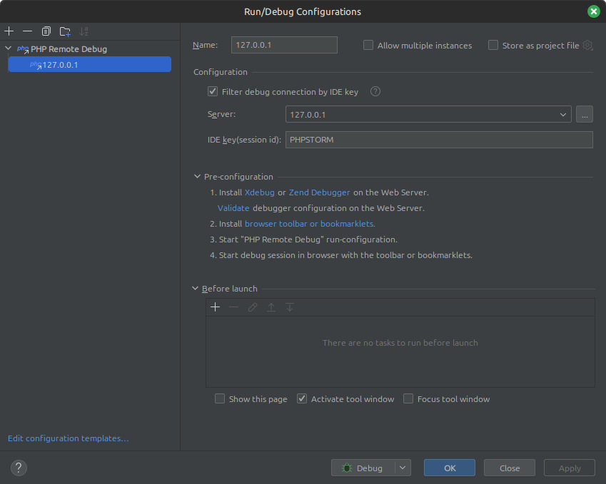

# IDE JetBrains PhpStorm
This document describing how you can configure your IDE [PhpStorm](https://www.jetbrains.com/phpstorm/).

## Configuring PhpStorm
### General
* Go to `Settings -> Plugins` and install next plugins:
    - Laravel
    - Php Inspections ​(EA Extended)​
* Go to `Settings -> Languages & Frameworks -> Php -> Laravel` and check `Enable plugin for this project`.
* Go to `Settings -> Languages & Frameworks -> Php -> Composer` and set path to composer.json, check other settings:

### CLI Interpreter
You need to set correct CLI interpreter for your PhpStorm. 
In order to do it please open `Settings -> Languages & Frameworks -> PHP` section and follow recommendations [configuring remote PHP interpreters](https://www.jetbrains.com/help/phpstorm/configuring-remote-interpreters.html).

### Server
In order to configure PHP servers please open `Settings -> Languages & Frameworks -> PHP -> Servers`.
You need to configure how your local files will be mapped inside docker container:

### Test Frameworks
If you want to run tests directly from your IDE you need to do following configuration in `Settings -> Languages & Frameworks -> PHP -> Test Frameworks`:

Next you need to add Run/Debug configuration for PHP Remote Debug. It need to be the same as image below:

### Debugging
In order to use Xdebug as debugging tool please follow [Using Xdebug](xdebug.md) documentation.

## External documentations
* [Configuring Remote PHP Interpreters](https://www.jetbrains.com/help/phpstorm/configuring-remote-interpreters.html)
* [Test Frameworks](https://www.jetbrains.com/help/phpstorm/php-test-frameworks.html)
* [Laravel Development using PhpStorm](https://blog.jetbrains.com/phpstorm/2015/01/laravel-development-using-phpstorm/)
* [Laravel Plugin plugin for PhpStorm](https://plugins.jetbrains.com/plugin/7532-laravel)
* [Php Inspections (EA Extended) plugin for PhpStorm](https://plugins.jetbrains.com/idea/plugin/7622-php-inspections-ea-extended-)
