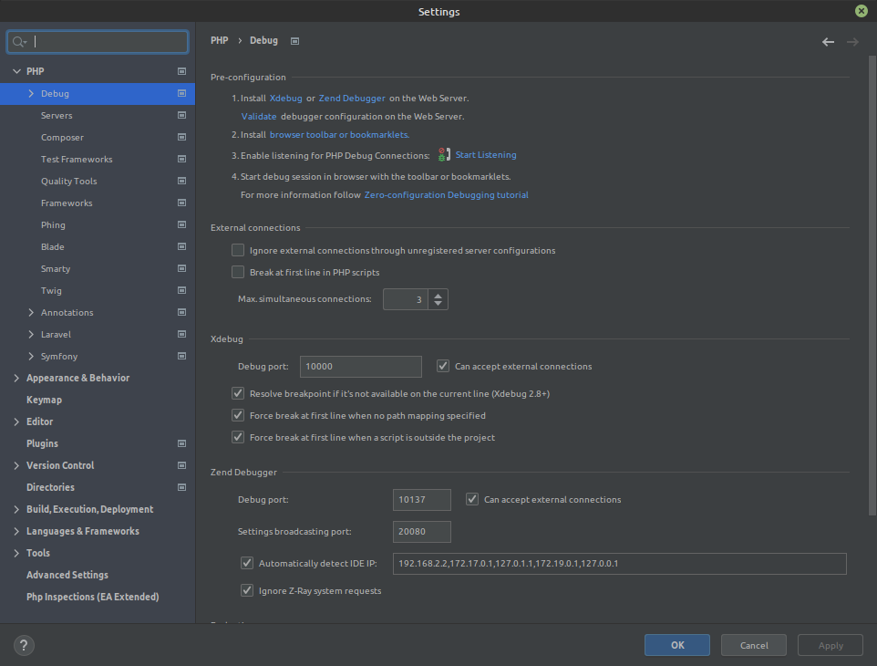
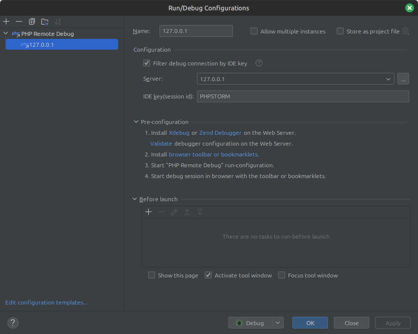
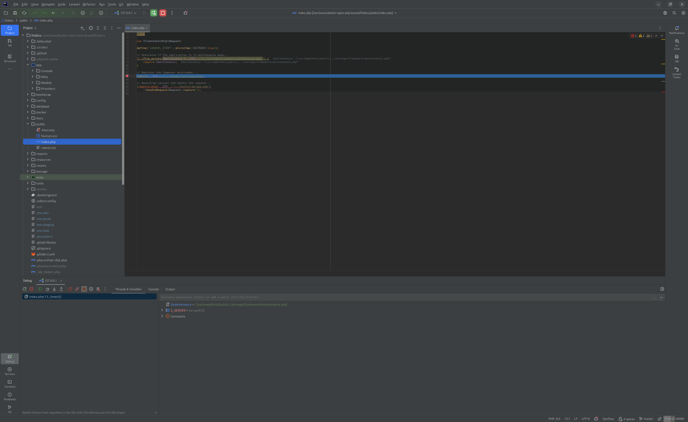

# Xdebug
This document describing how you can use [Xdebug](https://xdebug.org/) and [PhpStorm](https://www.jetbrains.com/phpstorm/) within this environment.

## Configuration and usage
Please follow [PhpStorm](phpstorm.md) documentation before actions described bellow.

### PhpStorm basic configuration
1.Check /docker/dev/xdebug.ini (optional)

- In case you need debug only requests with IDE KEY: PHPSTORM from frontend in your browser:
```bash
xdebug.remote_autostart = 0
```
Install locally in Firefox extension "Xdebug helper" and set in settings IDE KEY: PHPSTORM

- In case you need debug any request to an api (by default):
```bash
xdebug.remote_autostart = 1
```

2.Go to `Settings -> Languages & Frameworks -> Php -> Debug` and set Xdebug port `10000`

3.Check your `Run/Debug Configurations` as on image bellow

4.Install needed browser extensions (optional, see step 1). For example for Firefox install extension "Xdebug helper" and set in extension settings IDE KEY: PHPSTORM





### Using Xdebug
After actions above you can start to listen incoming PHP debug connections:

1. Add breakpoint to your code
2. Enable Xdebug in your browser (optional, required only when xdebug.remote_autostart = 0)
3. Click `Debug` button in PhpStorm
4. Reload browser page

If everything configured properly you will get something like next:



## Debug Postman requests
If you're using [Postman](https://www.getpostman.com/) to test/debug your application when `xdebug.remote_autostart = 0` you need to add `?XDEBUG_SESSION_START=PHPSTORM` to each URL
that you use with Postman. If you have default configuration (`xdebug.remote_autostart = 1`) - nothing to do and your Xdebug should work out of the box.

## External documentations
* [Debugging PHP (web and cli) with Xdebug using Docker and PHPStorm](https://thecodingmachine.io/configuring-xdebug-phpstorm-docker)
* [Debug your PHP in Docker with Intellij/PHPStorm and Xdebug](https://gist.github.com/jehaby/61a89b15571b4bceee2417106e80240d)
* [Debugging with Postman and PHPStorm (Xdebug)](https://www.thinkbean.com/drupal-development-blog/debugging-postman-and-phpstorm-xdebug)

